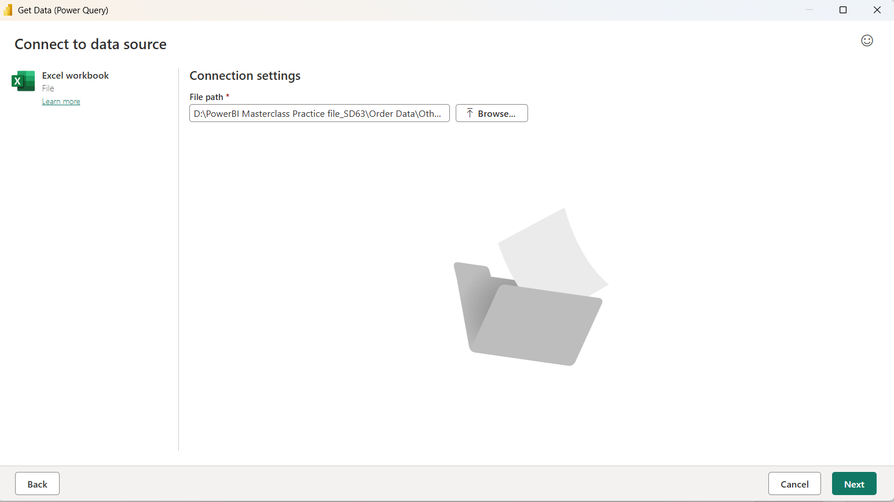
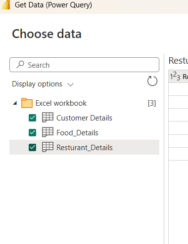
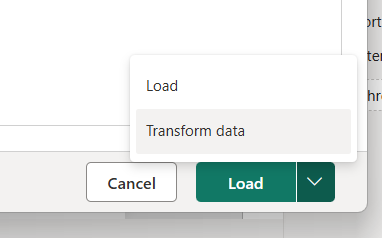
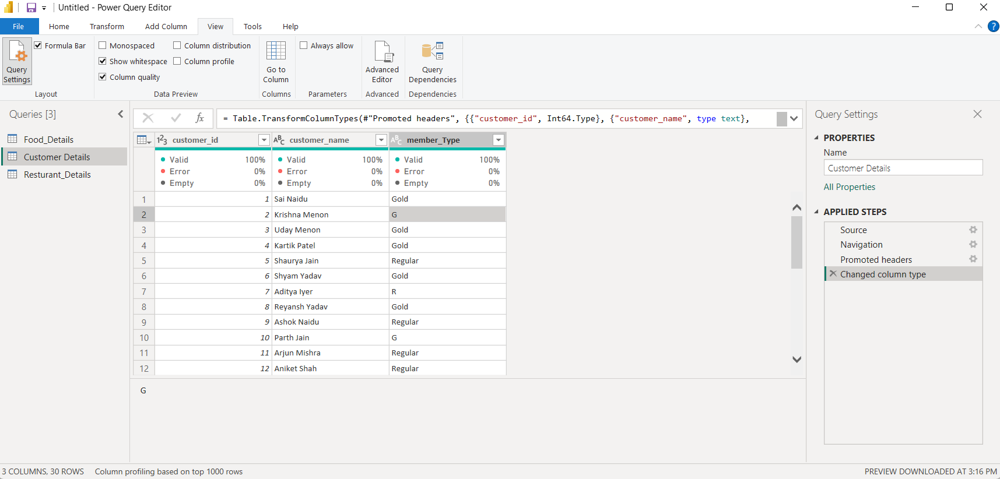
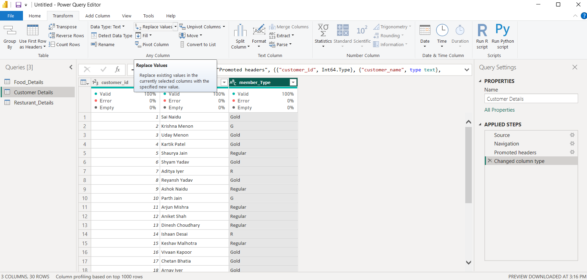
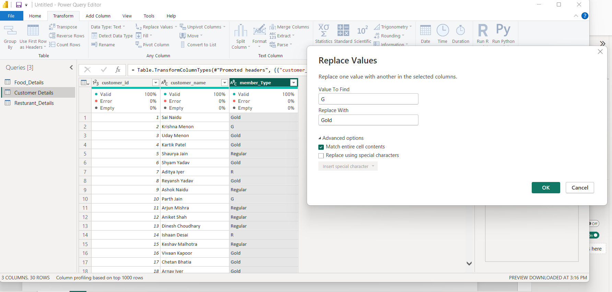
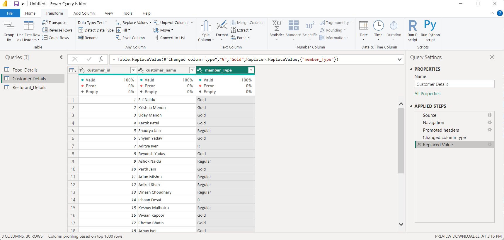
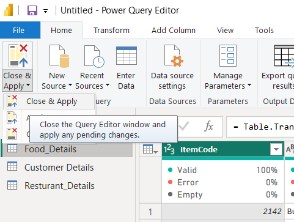

# 🍽️ Restaurant & Food Delivery Data Pipeline & Modeling - Power BI

An end-to-end Power BI project demonstrating multi-source data ingestion (Single File & Folder connectors), data cleaning in Power Query, and star schema relational data modeling.

---

## 📌 Project Overview

This repository demonstrates the foundational ETL (Extract, Transform, Load) and modeling workflow in Microsoft Power BI:
1. **Multi-Source Ingestion:** Importing dimensional sheets directly and appending folder-based transaction batches.
2. **Power Query Transformations:** Cleansing data types, standardizing dirty categorical values, and using exact-match replacement.
3. **Relational Data Modeling:** Constructing 1-to-many (`1:*`) relationships across customer, food, restaurant, and order tables.

---

## 🏗️ Data Architecture & Sources

| Table Name | Source Type | Nature | Key Attributes |
| :--- | :--- | :--- | :--- |
| **`Customer Details`** | Single Excel File | Dimension | `customer_id` (PK), `customer_name`, `member_Type` |
| **`Food_Details`** | Single Excel File | Dimension | `ItemCode` (PK), `Item_Name`, `Category`, `Price` |
| **`Resturant_Details`** | Single Excel File | Dimension | `Restaurant_ID` (PK), `Restaurant_Name`, `City`, `Cuisine` |
| **`Orders_Fact` / `Order Data`** | Folder Connector | Fact | `order_id`, `customer_id` (FK), `Restaurant_ID` (FK), `ItemCode` (FK), `Quantity` |

---

## 📸 Step-by-Step Implementation & Screenshots

### Step 1: Connecting to Data Sources
Connected to local storage using both **Excel Workbook** and **Folder** connectors to load dimensions and transactional order data.



---

### Step 2: Selecting Required Sheets
Selected the target entity tables (`Customer Details`, `Food_Details`, and `Resturant_Details`) from the workbook preview.



---

### Step 3: Navigating to Power Query for Transformations
Rather than loading raw dirty data directly, opted for **Transform Data** to clean and inspect each column in Power Query Editor.



---

### Step 4: Data Profiling & Column Quality Inspection
Inspected data quality distributions (Valid 100%, Error 0%, Empty 0%) and identified inconsistent categorical entries (`G` vs `Gold`, `R` vs `Regular`) in `member_Type`.



---

### Step 5: Applying Replace Values
Used Power Query's **Replace Values** transformation to standardize the categorical abbreviations into descriptive labels.



---

### Step 6: Handling Exact Match Logic (Edge-Case Prevention)
Enabled **"Match entire cell contents"** during replacement. 
> *Note:* Without selecting this option, replacing `'R'` with `'Regular'` incorrectly converts existing `'Regular'` values into `'Regularegular'`.



---

### Step 7: Cleaned Dataset Output
Both `G` and `R` codes were successfully standardized into clean `Gold` and `Regular` values across all 30 rows.



---

### Step 8: Close & Apply to Data Model
Applied all query transformation steps and loaded the clean tabular data into the Power BI engine.



---

## 🔗 Data Model & Relationships (Star Schema)

After loading, relationships were established between dimension tables and the central fact table:

```text
       [ Customer Details ] (1)
               │
               │ 1:* (customer_id)
               ▼
   ┌───────────────────────┐
   │    Orders (Fact)      │ ◄─── 1:* (Restaurant_ID) ─── [ Resturant_Details ] (1)
   └───────────────────────┘
               ▲
               │ 1:* (ItemCode)
               │
        [ Food_Details ] (1)
